# DRAGONBALL

## Descripción del Proyecto

DRAGONBALL es una aplicación web desarrollada con React y TypeScript que permite explorar personajes del universo Dragon Ball mediante el consumo de una API externa. La aplicación permite visualizar una lista de personajes, realizar búsquedas dinámicas y acceder a una página de detalle con información específica de cada personaje.

Para el desarrollo se utilizaron tecnologías modernas del ecosistema React, implementando una interfaz atractiva y responsive mediante Tailwind CSS y componentes reutilizables proporcionados por shadcn/ui. Asimismo, se empleó Axios para el consumo de servicios web, TanStack Query para la gestión eficiente de datos remotos y React Router para la navegación entre páginas.

---

## Herramientas y Tecnologías Utilizadas

### Frontend

* React
* TypeScript
* Vite

### Diseño UI/UX

* Tailwind CSS
* shadcn/ui
* Lucide React

### Consumo de API

* Axios
* Dragon Ball API

### Gestión de Datos

* TanStack Query

### Navegación

* React Router DOM

## Integrantes

* Sheila Diaz Rojas
* Naomi Sanchez Chavarria

---

## Evidencias del Desarrollo

### 01-proyecto-vite-funcionando.png

Creación inicial del proyecto utilizando Vite con React y TypeScript.

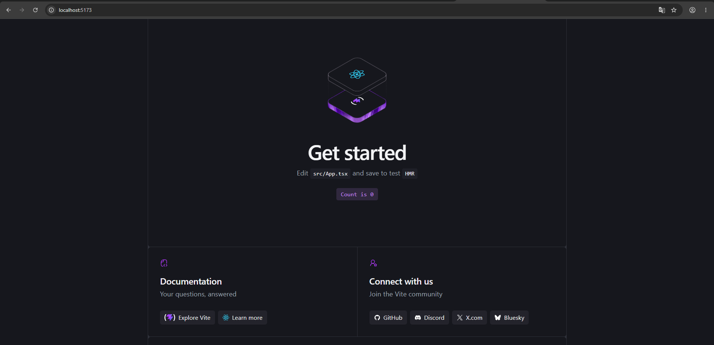

---

### 02-tailwind-funcionando.png

Instalación y configuración de Tailwind CSS.

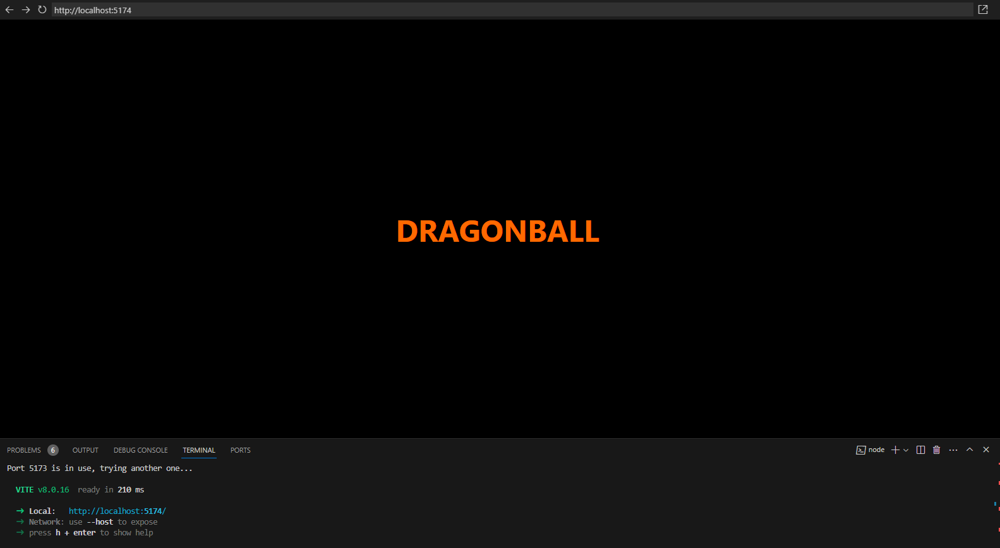

---

### 03-shadcn-instalado.png

Instalación y configuración de shadcn/ui.

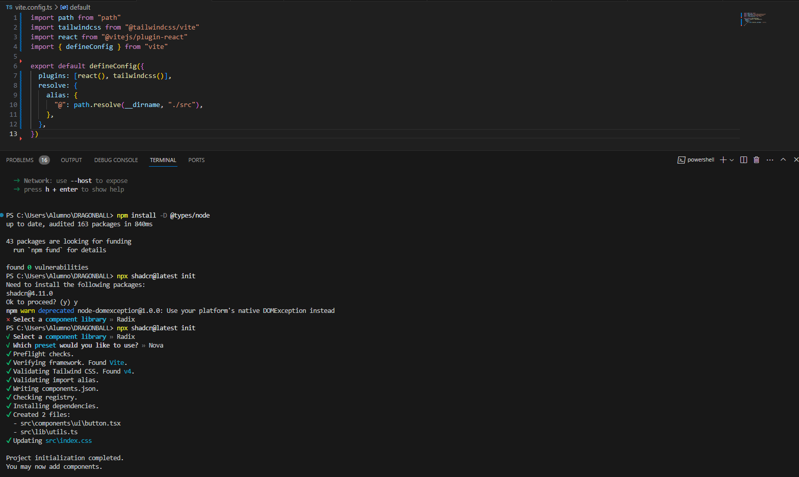

---

### 04-boton-shadcn-funcionando.png

Validación del componente Button generado con shadcn/ui.

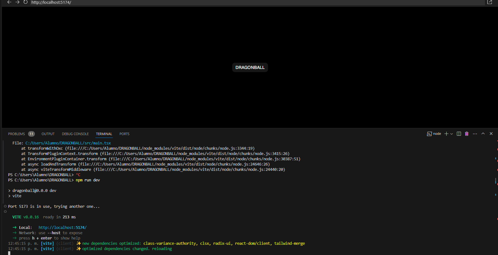

---

### 05-listado-dragonball.png

Primera versión del listado de personajes consumidos desde la Dragon Ball API.

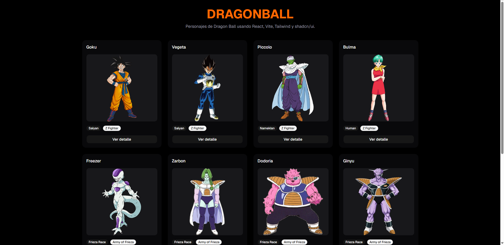

---

### 06-detalle-personaje.png

Primera implementación de la página de detalle de personajes utilizando React Router.

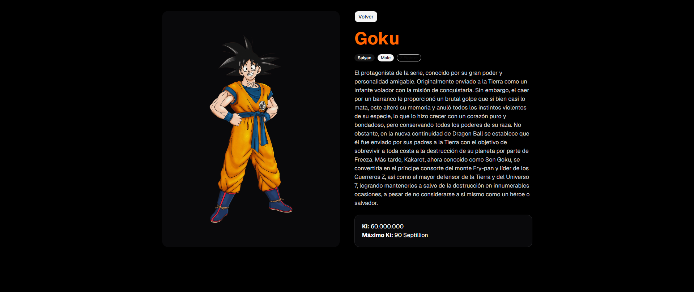

---

### 07-listado-dragonball-mejorado.png

Versión mejorada de la página principal incorporando buscador, diseño visual moderno y una mejor experiencia de usuario.

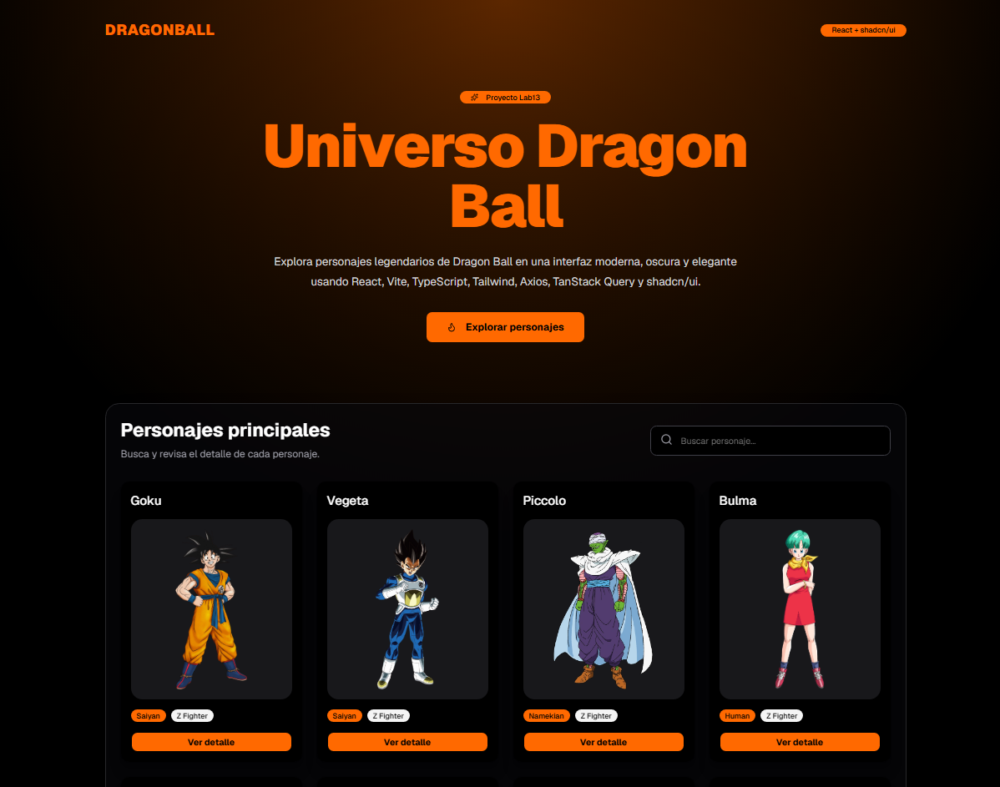

---

### 08-detalle-personaje-mejorado.png

Versión final de la página de detalle con diseño inspirado en Dragon Ball, mejor organización visual de la información y estadísticas del personaje.

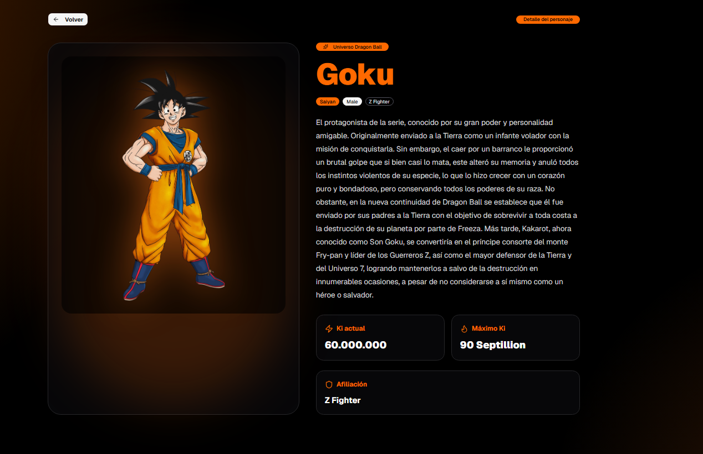

## Evidencias Naomi Sanchez

### Evidencia 01 - Proyecto Vite Corriendo

Creación inicial del proyecto utilizando Vite con React y TypeScript.

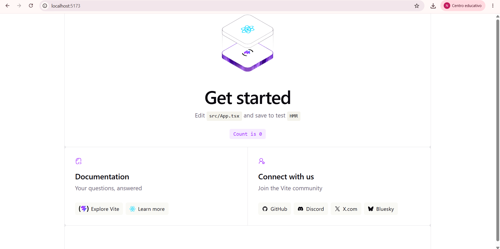

---
## Evidencia 02 - Instalación y configuración de Shadcn UI

Se instaló y configuró correctamente Shadcn UI en el proyecto DragonBall utilizando Vite, React y Tailwind CSS. Además, se agregaron los primeros componentes reutilizables para la interfaz: Button, Card, Badge e Input.

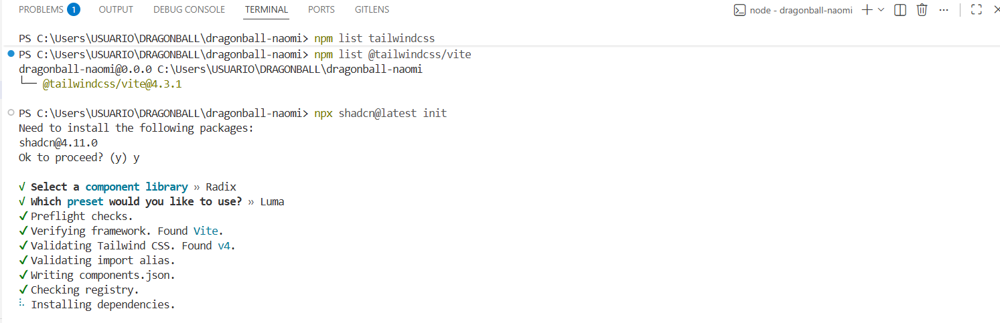

## Evidencia 03 - Primera vista con Tailwind CSS

Se creó una primera interfaz visual para el proyecto DRAGONBALL utilizando React, TypeScript y Tailwind CSS. En esta evidencia se muestra el título principal centrado en pantalla con un fondo oscuro, validando que Tailwind CSS se encuentra funcionando correctamente dentro del proyecto.

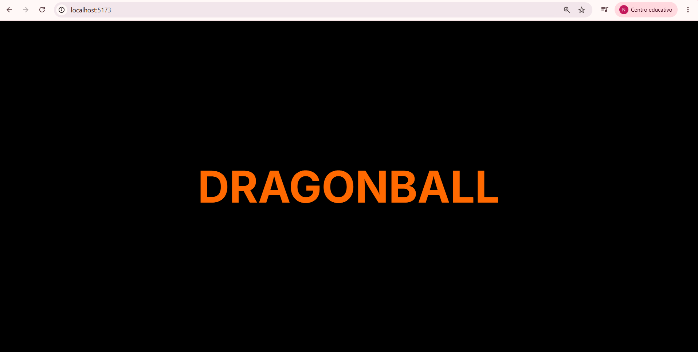

## Evidencia 04 - Instalación de librerías principales

Se instalaron las librerías necesarias para continuar con el desarrollo de la aplicación DRAGONBALL. Se agregó Axios para el consumo de la API, TanStack Query para la gestión de datos remotos, React Router DOM para la navegación entre páginas y Lucide React para el uso de iconos en la interfaz.

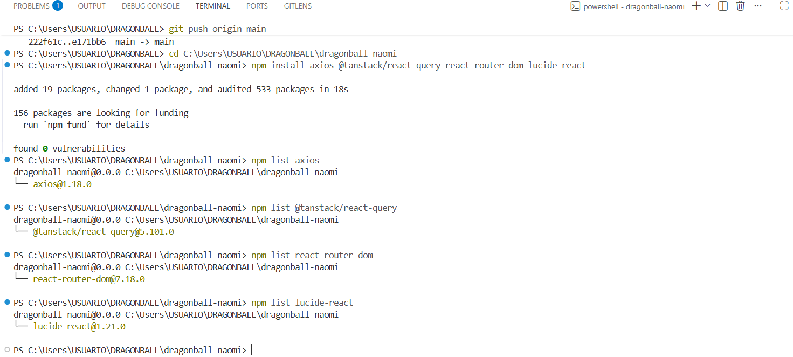

## Evidencia 05 - Configuración de React Router DOM

Se configuró React Router DOM en el proyecto DRAGONBALL para manejar la navegación entre páginas. Se creó una página principal llamada Home y se registró la ruta inicial `/`, manteniendo la vista principal del proyecto con el título centrado en pantalla.

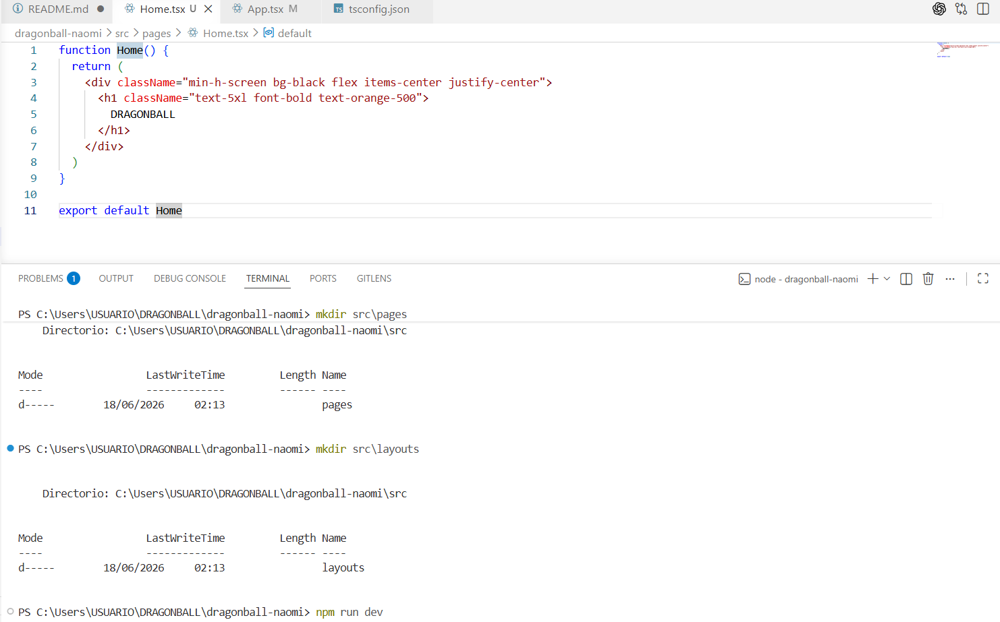

## Evidencia 06 - Implementación del listado de personajes

Se implementó el consumo de la Dragon Ball API utilizando Axios y TanStack Query. La aplicación obtiene dinámicamente la información de los personajes y los muestra mediante componentes reutilizables construidos con shadcn/ui y Tailwind CSS. Se visualizan datos como nombre, imagen, raza, género y nivel de Ki de cada personaje.

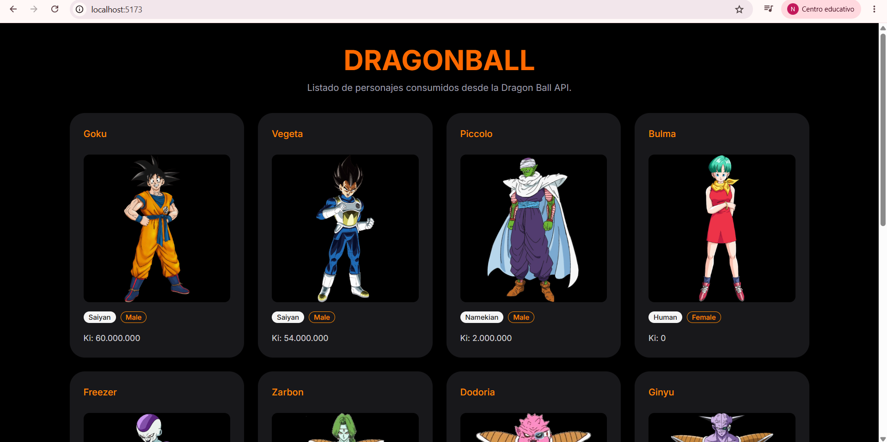